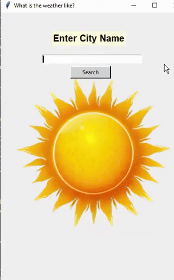

<h1>Weather Application</h1>

<h2>Do you wonder what's the weather like your city?</h2>

<h3>Application Properties</h2>

<h4>you can able to reach some weather factors about your city which are
Tempurature,wind,pressure,and sky stuation
</h4>

<h3>Coded using Tkinter interface which is from python</h2>

<h3>Application videoGif</h2>

